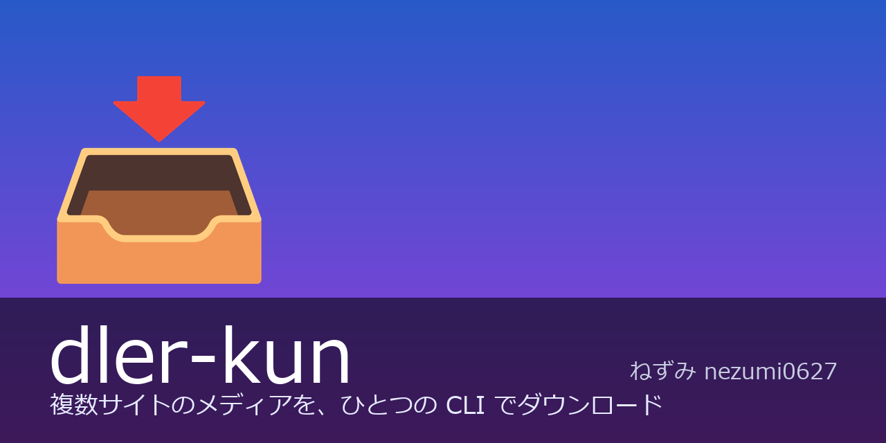

# dler-kun

<p align="center">
  
</p>

複数サイトのメディアを、ひとつの CLI でダウンロードするツール。URL を渡せば対応サイトを自動判定し、単発ダウンロードからランキング収集・期間指定クロールまで同じコマンド体系で扱えます。

<p align="left">
  
  
  
</p>

> **免責事項** — 実験・教育目的のツールです。権利のないコンテンツの取得には使わないでください。DRM の回避や認証の突破は行いません。利用者は各国の法律・対象サイトの規約を遵守する責任があります。[LEGAL.md](LEGAL.md)

---

## クイックスタート

```bash
git clone https://github.com/nezumi0627/dler-kun.git
cd dler-kun
python -m venv .venv
.\.venv\Scripts\Activate.ps1      # Windows (PowerShell)
source .venv/bin/activate         # macOS / Linux
pip install -e .
```

```bash
dler-kun download https://gofile.io/d/example -o downloads
dler-kun crawl 85xo --days 15 --download
dler-kun ranking gofile --source douga --download
```

> PATH へ登録してどこからでも使いたい場合は [docs/install.md](docs/install.md) を参照。

---

## 対応サイト

| Site | 対象ドメイン | download | crawl | ranking |
|------|--------------|:--------:|:-----:|:-------:|
| **gofile** | gofile.io | ✓ | | |
| **gofile-douga** | gofile-douga.com | ✓ | ✓ | ✓ |
| **gofilelab** | gofilelab.com | ✓ | ✓ | ✓ |
| **gofilerun** | gofile.run | ✓ | ✓ | |
| **85xo** | 85xo.com · 85po.net · 85po.com | ✓ | ✓ | |
| **twimg** | twimg-media | ✓ | | |
| **mvfile** | mvfile.com · tweetfile.com · gofile.website · image-share.cc | ✓ | ✓ | |
| **videy** | video.twimg.news · videy.co | ✓ | | |
| **mixixxx** | mixi-xxx.cc | ✓ | ✓ | |

対応していないサイトの追加要望は **Issue** からどうぞ（下記「サイト追加リクエスト」）。

---

## ドキュメント

| ドキュメント | 内容 |
|--------------|------|
| [cli.md](docs/cli.md) | コマンド・オプション・終了コード |
| [install.md](docs/install.md) | インストール詳細・PATH 登録 |
| [config.md](docs/config.md) | 設定ファイル・キャッシュ |
| [sources.md](docs/sources.md) | クロール/ランキングのソース別名 |
| [engines.md](docs/engines.md) | サイトごとの能力 |
| [architecture.md](docs/architecture.md) | 内部構成 |

---

## サイト追加リクエスト

対応してほしいサイトがある場合は、[サイト追加リクエスト](https://github.com/nezumi0627/dler-kun/issues/new?assignees=&labels=enhancement&projects=&template=site_request.md&title=) から Issue を投稿してください。URL のサンプルと利用目的を添えると対応しやすくなります。

---

## ライセンス

[MIT](LICENSE) — 自由にコピー・変更・再配布できます。再配布時は著作権表示（作者名）の保持が条件です。vendored エンジン・外部ツール（ffmpeg / Chrome）の扱いは [NOTICE](NOTICE) を参照。
